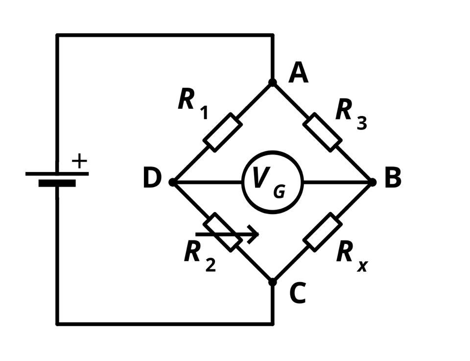

## How do they work?

When the gauge is deformed, usually by increasing or decreasing tension parallel to the substrate (thing on which it is placed), the electrical resistance changes. This change is usually measured using a wheatstone bridge, an electrical circuit that can measure the resistance value in an unknown piece (in our case the strain gauge).

The wheatstone bridge uses the known values of the resistances to calculate the unknown resistance. The formula is: Rx = R3 * R2 / R1. Derivation using Kirchhoff's Loop Rule (Voltage Law) and Current Law is given [here](https://en.wikipedia.org/wiki/Wheatstone_bridge#Full_derivation_using_Kirchhoff's_circuit_laws). However, this formula only works for a balanced bridge, which means that R2 must be adjustable. When all the 3 known resistors are fixed, there is another formula which uses the Voltage between D and B (VG) and the input voltage to calculate the value of Rx (also given in above link).

To calculate the length the strain gauge is tensioned by, this  formula applies:
$\displaystyle GF={\frac {\Delta R/R_{G}}{\epsilon }}$ where $\epsilon$ is the strain on the gauge, given by the equation $\epsilon = \frac{\Delta L}{L}$. After calculating the gauge factor ($\displaystyle GF$) using tested values, the sensor is ready to be used in the field.

Afterward, the following equation is used to calculate $\epsilon$:
$\newline {\displaystyle SV=EV{\frac {GF\cdot \epsilon }{4}}}$

The Sensor Voltage $\displaystyle SV$ is recorded through the output of the wheatstone bridge and then the length can then be calculated from $\epsilon$.

## Advantages and Disadvantages of using an FPC

| Advantages | Disadvantages |
| ---------- | ------------- |
| Will be cheap and easy to remake | Likely is much more sensative to temperature/humidity changes |
| | Low accuracy |
| | Needs to be calibrated before each run due to temperature and humidity concerns |

## Calculations

Using [this](https://www.omnicalculator.com/other/pcb-trace-resistance) calculator, I found the length at which the resistance is 350 $\Omega$: 19.03 inches. 

Then, in KiCAD, I created a PCB with that length of wire along with two copper zones for the terminals on each end. I ensured that I used the JLC minimum of 3 mil trace width and 3 mil trace spacing for the 12 micrometer copper thickness, the minimum. I also created a rectangle around this on the edge-cuts layer.